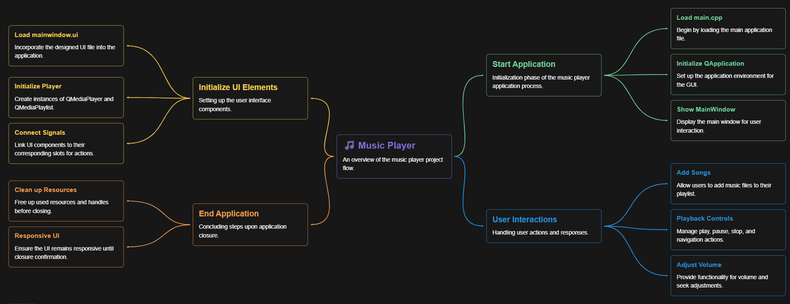

# Music Player Project - Final Presentation

## About the Project

This is a *cross-platform music player* developed using *C++ with Qt* for the GUI and *SQLite* for data management. The player supports basic music playback functionality, user interaction through a GUI, and persistent storage of playlists and song metadata.

It’s a simple, clean, and extensible application that demonstrates usage of GUI frameworks, object-oriented design principles, and integration with a local database.

## Local Setup Instructions

### Prerequisites

- Qt 5 or 6 (Qt Creator recommended)
- C++ Compiler (GCC/Clang/MSVC)
- CMake (if building manually)
- SQLite (already integrated, no external install needed)

### Steps to Setup

1. Clone the forked repository:
   bash
   git clone https://github.com/YOUR_USERNAME/music-player.git
   cd music-player
   
2. Open the project using *Qt Creator* or build manually using:
   bash
   mkdir build && cd build
   cmake ..
   make
   
3. Run the generated executable:
   bash
   ./music-player
   

## Basic Working

- The application allows users to:
  - Browse and add audio files.
  - Create and manage playlists.
  - Play, pause, skip, and stop tracks.
  - View metadata of selected songs.
  - Store song and playlist data persistently using SQLite.

## Work Flow
  

## Implementation Details

### Data Structures Used

- *Classes/Objects*:
  - Song class to represent individual audio files.
  - Playlist class to handle collections of Song objects.
- *Standard Library containers*:
  - std::vector for storing lists of songs and playlists.
  - std::map for mapping metadata or UI elements if needed.

### Database

- *SQLite* is used to:
  - Store songs and playlists locally.
  - Enable persistent storage of user data between sessions.
- Integrated using QSqlDatabase from the Qt SQL module.

### GUI

- *Qt Framework (Widgets)* is used to build:
  - A responsive and intuitive interface.
  - Components include buttons, sliders, tables, and menus.
- Signals and slots are used for interactivity.

## How Things Are Modelled

- *Model-View design pattern*:
  - Song and playlist data modeled as backend objects.
  - Qt Views and Widgets act as the front-end representation.
- Separation of concerns between playback logic, UI, and database handling.

## Extra Features

- *SQLite Integration*: Persistent playlist and song data across sessions.
- *Drag and Drop Support*: Add songs by dragging files into the player.
- *Volume Control and Progress Bar*: Interactive controls for user convenience.
- *Metadata Extraction*: Using Qt Multimedia for displaying song info.

## Future Work
- Implement search functionality within the playlist.
- Add shuffle and repeat features.
- Improve UI with modern design patterns.
- Cross-device sync using cloud.
